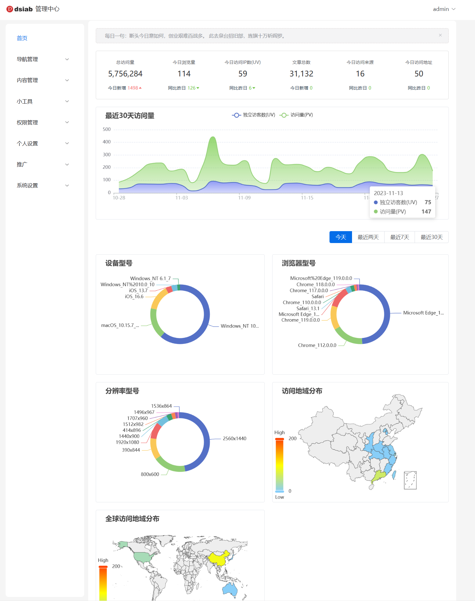

<div><a href="https://github.com/esplori/vueAdminPlus/blob/master/README.md">中文</a>  |  <a href="https://github.com/esplori/vueAdminPlus/blob/master/README.en.md">ENGLISH</a></div>

<h1 align="center" style=" font-weight: bold;">vueAdminPlus</h1>
<h5 align="center">基于vue3.0 + element-plus + typeScript开发的博客后台管理系统</h5>


<p align="center" style="padding:10px">
	<a href="https://gitee.com/wilkwo/vue-admin-plus.git"></a>
	<a href="https://gitee.com/wilkwo/vue-admin-plus.git"></a>
</p>


### 项目介绍

- 主要技术栈: vuejs3.0 + vue-router + pinia + element-plus + typescript + scss

- 使用到的插件： axios + wangeditor5 + echarts5 + countup.js

- 启动项目可直接看到效果，默认调用是官网的后台管理接口，使用体验账号登录即可。

### 主要功能


- 首页看板：访问数据统计
- 文章管理：新增、删除、查询、修改文章
- 评论管理：评论查询、删除
- 分类管理：新增、删除分类
- 专题管理：新增专题、编辑专题、删除专题
- 导航管理：查询导航、分类管理、新增导航
- 权限管理：用户管理、角色管理、菜单管理 
- 个人设置：用户个人信息修改
- 系统设置：站点设置、资源管理、回收站、发送邮件、系统通知
- 常用工具：
	- 在线电子书
	- json格式化
	- 在线抽奖
	- 在线点名
	- 图片转base64
	- 在线生成二维码
	- ip 归属地查询
	- 在线音乐
	- 持续更新中...


### 关联项目

- 博客首页: nuxtWebPlus (https://gitee.com/wilkwo/nuxt-web-plus.git) 
  
- 体验地址：https://www.dsiab.com


### 体验地址


- 地址：http://admin.dsiab.com

- 体验账号、密码： test / test
  
- 加qq群一起交流：514450699


### 演示截图





### 运行项目


``` bash

#下载代码
gitee: git clone https://gitee.com/wilkwo/vue-admin-plus.git
# 安装依赖
npm install
# 启动应用 
npm run dev
# 生成应用
npm run build

```

### 感谢赞赏  


 创作不易，你的赞赏和认可是持续更新的动力~

